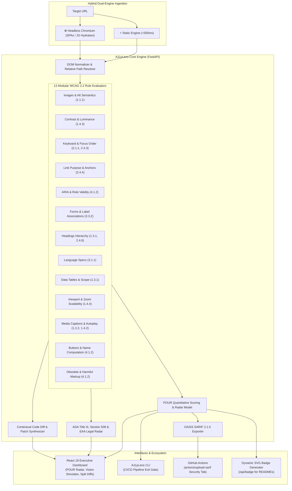

# A11yLens

<div align="center">


-orange?style=for-the-badge)


**Enterprise WCAG 2.2 Web Accessibility Intelligence & Auto-Remediation Platform**

*Audit live web applications against W3C guidelines, evaluate client-side SPAs via Headless Chromium, calculate POUR principle compliance radar scores, simulate color blindness, synthesize 1-click code patches, and enforce CI/CD accessibility gates.*

[Key Features](#-key-features) • [POUR Compliance Matrix](#-pour-compliance-matrix) • [Architecture](#-architecture) • [Getting Started](#-getting-started) • [CI/CD & SARIF Integration](#-cicd--sarif-integration) • [API Reference](#-api-reference)

</div>

---

## 🌟 Overview

**A11yLens** is an automated web accessibility intelligence platform designed to eliminate accessibility barriers on the modern web. 

Unlike conventional static tag scanners that miss client-side hydrated frameworks (React, Vue, Next.js), A11yLens features a **Hybrid Dual-Engine** combining low-latency HTTP parsing with deep **Headless Chromium execution**. It computes luminosity-based color contrast ratios, verifies keyboard focus order, evaluates ARIA state validity, generates **POUR Radar diagnostics**, assesses **ADA / Section 508 / EAA legal exposure**, and outputs industry-standard **OASIS SARIF 2.1.0** reports for automated GitHub Code Scanning.

---

## 🏗️ Architecture



---

## ⚡ Key Features

- **Hybrid Dual-Engine Ingestion**: Toggle between ultra-fast static HTTP parsing (<500ms) and full **Headless Chromium** browser execution to audit dynamic, JavaScript-heavy single-page applications.
- **14+ Modular WCAG 2.2 Rule Evaluators**: Comprehensive checks across non-text alternatives, relative luminance contrast math, orphan form controls, interactive keyboard traps, target sizing (2.5.8), and deprecated HTML tags.
- **🔊 Screen Reader Audio Simulator**: VoiceOver & NVDA auditory speech simulator powered by the Web Speech API—hear sequential screen reader announcements directly in your browser.
- **🌐 Multi-Page Domain Crawler**: Crawls internal routes on a domain, computes aggregate site scores, and identifies top recurring systemic defects.
- **POUR Principle Radar Diagnostics**: Issues are weighted by severity (*Critical: 10 pts, Serious: 6 pts, Moderate: 3 pts, Minor: 1 pt*) and rendered in an interactive Chart.js Radar Chart alongside WCAG AA benchmark targets.
- **Legal & Regulatory Risk Matrix**: Real-time compliance assessment for **ADA Title III**, **Section 508**, and the **European Accessibility Act (EAA 2025)**.
- **Side-by-Side Split Code Diffs**: Every violation features a side-by-side diff showing the offending code alongside the corrected accessible markup with 1-click copy options.
- **Color Blindness Vision Simulator**: Real-time SVG filter simulation embedded in the live sandbox: test how websites appear under **Protanopia**, **Deuteranopia**, **Tritanopia**, and **Achromatopsia**.
- **Enterprise SARIF 2.1.0 Exporter**: Directly outputs standard OASIS SARIF format for automated ingestion into the **GitHub Security Code Scanning** dashboard.
- **Dynamic README Badges**: Generate live SVG compliance badges (`/api/badge?score=...`) to showcase accessibility scores in public repositories.
- **Developer CLI (`cli.py`)**: Terminal tool with colored executive summaries and configurable pass/fail exit gates (`--fail-on critical`, `--min-score 85`).

---

## 📊 POUR Compliance Matrix

A11yLens maps every detected defect to its official WCAG 2.2 criterion and POUR principle:

| Principle | Rule ID | WCAG Criterion | Level | Description |
| :--- | :--- | :--- | :---: | :--- |
| **Perceivable** | `IMG_ALT_MISSING` | **1.1.1** Non-text Content | A | Image missing alternative text |
| **Perceivable** | `IMG_ALT_SUSPICIOUS` | **1.1.1** Non-text Content | A | Image using filler words ('image', 'photo') |
| **Perceivable** | `VIDEO_MISSING_CAPTIONS`| **1.2.2** Captions (Prerecorded) | A | `<video>` lacking caption tracks |
| **Perceivable** | `CONTRAST_LOW` | **1.4.3** Contrast (Minimum) | AA | Foreground/background text contrast < 4.5:1 |
| **Perceivable** | `VIEWPORT_ZOOM_DISABLED`| **1.4.4** Resize Text | AA | `user-scalable=no` preventing pinch-to-zoom |
| **Operable** | `KEYBOARD_NON_INTERACTIVE`| **2.1.1** Keyboard | A | Click handler on non-focusable element |
| **Operable** | `KEYBOARD_POSITIVE_TABINDEX`| **2.4.3** Focus Order | A | Positive `tabindex` disrupting tab order |
| **Operable** | `LINK_EMPTY` | **2.4.4** Link Purpose | A | Hyperlink with no accessible text |
| **Operable** | `LINK_GENERIC_TEXT` | **2.4.4** Link Purpose | A | Ambiguous link text ('click here', 'more') |
| **Operable** | `PAGE_MISSING_TITLE` | **2.4.2** Page Titled | A | Webpage missing `<title>` tag |
| **Operable** | `HEADING_LEVEL_SKIP` | **2.4.6** Headings and Labels | AA | Skipped heading hierarchy (e.g. H1 to H3) |
| **Operable** | `TARGET_SIZE_TOO_SMALL` | **2.5.8** Target Size (Minimum) | AA | Interactive target dimensions < 24x24px |
| **Understandable** | `LANG_MISSING` | **3.1.1** Language of Page | A | `<html>` root missing `lang` attribute |
| **Understandable** | `FORM_MISSING_LABEL` | **3.3.2** Labels or Instructions | A | Form control lacking accessible `<label>` |
| **Understandable** | `TABLE_MISSING_TH` | **1.3.1** Info and Relationships | A | Data table missing `<th>` header cells |
| **Robust** | `BUTTON_EMPTY` | **4.1.2** Name, Role, Value | A | Button lacking accessible name |
| **Robust** | `ARIA_INVALID_ROLE` | **4.1.2** Name, Role, Value | A | Non-standard or fabricated ARIA role |
| **Robust** | `ARIA_HIDDEN_FOCUSABLE` | **4.1.2** Name, Role, Value | A | Focusable element with `aria-hidden="true"` |
| **Robust** | `OBSOLETE_TAGS` | **4.1.2** Parsing | A | Deprecated tags (`<marquee>`, `<blink>`) |

---

## 🚀 Getting Started

### Prerequisites
- **Python 3.9+**
- **Node.js 18+**

### 1. Backend Setup
```bash
cd backend

# Create and activate virtual environment (optional)
python -m venv venv
source venv/bin/activate  # On Windows: venv\Scripts\activate

# Install dependencies
pip install -r requirements.txt

# Start FastAPI server
uvicorn main:app --reload --port 8000
```
*API will run at `http://localhost:8000` with Swagger docs at `http://localhost:8000/docs`.*

### 2. Frontend Setup
```bash
cd frontend

# Install npm packages
npm install

# Start Vite dev server
npm run dev
```
*Open `http://localhost:5173` in your browser.*

### 3. Command-Line Interface (CLI)
You can run automated audits directly from your terminal:

```bash
# Run standard terminal audit (Fast static mode)
python a11ylens.py https://example.com

# Run deep Headless Chromium audit (for client-side SPAs)
python a11ylens.py https://example.com --engine dynamic

# Export SARIF report for GitHub Code Scanning
python a11ylens.py https://example.com --format sarif --output a11y-report.sarif

# Enforce CI/CD quality gate (fail if score < 85 or critical issues exist)
python a11ylens.py https://example.com --min-score 85 --fail-on critical
```

---

## 🔄 CI/CD & SARIF Integration

A11yLens integrates directly into **GitHub Actions** via `.github/workflows/a11ylens.yml`:

```yaml
name: "A11yLens Accessibility Audit"

on:
  push:
    branches: [ "main" ]
  pull_request:
    branches: [ "main" ]

jobs:
  accessibility-audit:
    runs-on: ubuntu-latest
    permissions:
      contents: read
      security-events: write
    steps:
      - uses: actions/checkout@v4
      - uses: actions/setup-python@v5
        with:
          python-version: "3.11"
      - run: pip install -r backend/requirements.txt
      - name: Run A11yLens Audit Engine & Export SARIF
        run: |
          python backend/cli.py https://example.com --format sarif --output results.sarif --min-score 80
      - name: Upload Results to GitHub Security Tab
        uses: github/codeql-action/upload-sarif@v3
        if: always()
        with:
          sarif_file: results.sarif
```

---

## 🔌 API Reference

| Method | Endpoint | Description |
| :--- | :--- | :--- |
| `GET` | `/` | API service metadata, active engines, and version specs |
| `GET` | `/api/health` | Health check endpoint |
| `POST` | `/api/audit` | Audits target URL (`engine: "fast"` or `"dynamic"`); returns scores, POUR metrics, and issues |
| `POST` | `/api/audit/sarif` | Generates standard OASIS SARIF 2.1.0 document |
| `POST` | `/api/remediate` | Generates contextual accessible replacement code snippet |
| `GET` | `/api/badge` | Generates embeddable SVG compliance badge (`?score=94&grade=A`) |

---

## 📄 License

This project is licensed under the MIT License - see the [LICENSE](LICENSE) file for details.
